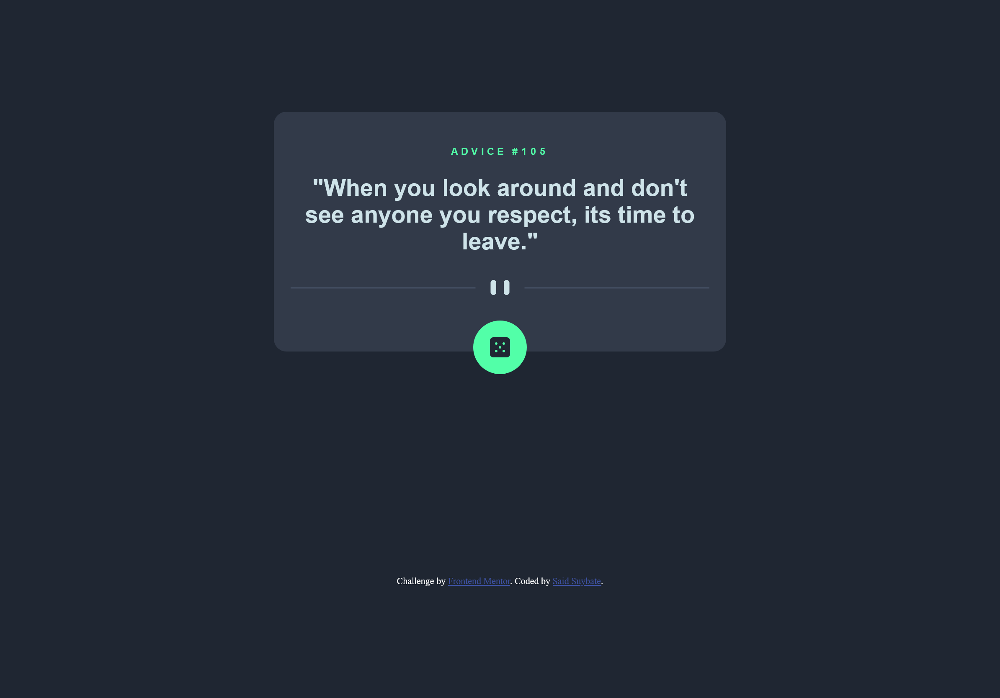

# Frontend Mentor - Advice generator app solution

This is a solution to the [Advice generator app challenge on Frontend Mentor](https://www.frontendmentor.io/challenges/advice-generator-app-QdUG-13db). Frontend Mentor challenges help you improve your coding skills by building realistic projects.

## Table of contents

- [Overview](#overview)
  - [The challenge](#the-challenge)
  - [Screenshot](#screenshot)
  - [Links](#links)
- [My process](#my-process)
  - [IMPORTANT NOTE](#important-note)
  - [Built with](#built-with)
  - [Continued development](#continued-development)
  - [Useful resources](#useful-resources)
- [Author](#author)

## Overview

### The challenge

Users should be able to:

- View the optimal layout for the app depending on their device's screen size
- See hover states for all interactive elements on the page
- Generate a new piece of advice by clicking the dice icon

### Screenshot

### Links

- Solution URL: [Frontend Mentor Solution](https://your-solution-url.com)
- Live Site URL: [Live Website](https://saidsuyv.github.com/advice-generator)

## My process

I firstly started doing the styling and structuring. I used the "mobile first" structuring method for this project and once I finished structuring I just connected the JS script so each text can update once you made the request.

### IMPORTANT NOTE

I noticed that in my tests, you would be getting the same advice at least you wait like 2 minutes, I sincerely don't know why this happens like that but at the end, the fact is how I build this project so, enjoy it! :).

### Built with

- Semantic HTML5 markup
- CSS custom properties
- Flexbox
- CSS Grid
- Mobile-first workflow
- JS ES6 Vanilla Script

### Continued development

I'll be still updating this using a better CSS code or HTML because I completely feel like I'm not doing as well as it should be, highlightning the fact that I've learnt all of this by myself, it's quite difficult to identify when I'm doing right or wrong or which is a mistake or not.
Feel free to feedback me on Frontend Mentor platform or send me an [e-mail](mailto:sirsv.contacto@gmail.com) if you liked this project, I would love to get any advice or something that helps me to get even better.

### Useful resources

I used an advice that I got on a earlier project which is the [Product component project](https://www.frontendmentor.io/solutions/product-view-card-component-VMpf1zUc-m). I didn't know the effective element called "picture" and all the things that I could do with it, here are the links to the resources I read before.

- [HTML images picture](https://www.w3schools.com/html/html_images_picture.asp)
- [Picture element](https://web.dev/learn/design/picture-element/)

## Author

- Website - [Said Suybate](https://said.digysoft.com)
- Frontend Mentor - [@SaidSuyv](https://www.frontendmentor.io/profile/SaidSuyv)
- GitHub - [@SaidSuyv](https://github.com/SaidSuyv)